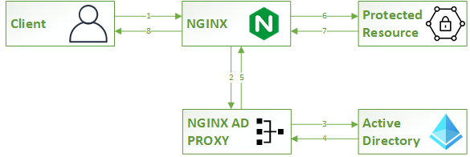

# NGINX Active Directory Proxy

__Service for authenticating users against Active Directory for the NGINX [auth_request_module](https://nginx.org/en/docs/http/ngx_http_auth_request_module.html)__

## Overview
This software provides a service that can be used with the NGINX _[auth_request_module](https://nginx.org/en/docs/http/ngx_http_auth_request_module.html)_. If you need to protect a website, part of a website or even a downstream application that you are protecting, you are able to use this service in conjunction with the _[auth_request_module](https://nginx.org/en/docs/http/ngx_http_auth_request_module.html)_.




## Features
* Authenticates against Active Directory.
* No need for a bind user service account. Validates using user credentials entered.
* Allows specifying Groups in the _[nginx.conf](http://nginx.org/en/docs/beginners_guide.html#conf_structure)_ file. Users must belong to listed Groups to be allowed access.
* Allows specifying Users (via username) that are allowed access.
* Allows mixing of Groups and User (via _OR_ - i.e. User must be in either the specified Groups or the specified Users).
* Can be run as a Docker image or as a standard process.
* Uses TLS over port 389

## Requirements
1. [Python 3.6+](https://www.python.org/)
2. [Gunicorn](https://docs.gunicorn.org/en/stable/install.html) (Linux)
3. [Waitress](https://pypi.org/project/waitress/) (Windows)
4. [pipenv](https://pypi.org/project/pipenv/)
5. [Docker](https://www.docker.com/) (optional)

## Getting started - configuring NGINX AD Proxy
### Recommended: create a user with which to run nginx-ad-proxy - e.g.:
```bash
useradd -m -s /bin/bash -c "NGINX AD Proxy User" nginx-ad-proxy
passwd nginx-ad-proxy
sudo su - nginx-ad-proxy
```
### Obtain nginx-ad-proxy and install dependencies
```bash
git clone https://github.com/nishen/nginx-ad-proxy
cd nginx-ad-proxy
pipenv sync
```

### Configure your environment
Edit the __.env__ file and add your settings:
```bash
AD_DOMAIN=COMPANY
AD_HOST=server.company.org
AD_PORT=389
AD_BASEDN=OU=Active,OU=Users,DC=company,DC=org
DEBUG=0
```
_NOTE: Works with using TLS over port 389_

### Start the service
The run scripts are configured in Pipfile under the scripts section.
```
[scripts]
launch = "gunicorn -b 127.0.0.1:9091 service_auth_ad:api"
launch-win = "waitress-serve --listen 127.0.0.1:9091 service_auth_ad:api"
```

Linux (assumes gunicorn installed)
```bash
pipenv run launch
```

Windows (assumes waitress-serve installed)
```bash
pipenv run launch-win
```

## Getting started - configuring NGINX
### Creating the block that points to the proxy
```
    location /auth-ad {
      internal;

      # this line points to the service you've configured above.
      proxy_pass                http://127.0.0.1:9091/auth;
      proxy_http_version        1.1;
      proxy_pass_request_body   off;
      proxy_set_header          Host $host;
      proxy_set_header          Connection "";
      proxy_set_header          Content-Length "";
      proxy_set_header          X-Real-IP $remote_addr;
      proxy_set_header          X-Forwarded-For $proxy_add_x_forwarded_for;
      proxy_set_header          X-Forwarded-Proto $scheme;
      proxy_set_header          X-Original-URI $request_uri;

      # the next 2 lines allow us to pass a list of valid groups and/or users
      proxy_set_header          X-Auth-Groups $xAuthGroups;
      proxy_set_header          X-Auth-Users $xAuthUsers;

      # caching strategy - configure this however you'd like. Helps with performance.
      proxy_cache               auth_cache;
      proxy_cache_key           "$http_authorization";
      proxy_cache_valid         200 1m;
      proxy_ignore_headers      Cache-Control Expires Set-Cookie;
    }
```

* [NGINX Auth Request Module](https://nginx.org/en/docs/http/ngx_http_auth_request_module.html)
* [NGINX Proxy Module (including proxy_cache)](https://nginx.org/en/docs/http/ngx_http_proxy_module.html)

### Protecting the resource
You can protect 1 or more resources with a block like this:
```
    location /protected-resource {
      proxy_pass         http://127.0.0.1:8080/protected/resource/backend/url;

      # variable is used in the /auth-ad block to make authorization decisions.
      set $xAuthGroups   "AD-GRP-SHIELD";
      set $xAuthUsers    "tony.stark,bucky.barnes";
      set $realm "Protected web Application";

      proxy_http_version 1.1;
      proxy_redirect     off;
      proxy_set_header   Connection "";
      proxy_set_header   Host              $host;
      proxy_set_header   X-Real-IP         $remote_addr;
      proxy_set_header   X-Forwarded-For   $proxy_add_x_forwarded_for;
      proxy_set_header   X-Forwarded-Proto $scheme;

      auth_request            /auth-ad;
      auth_request_set        $auth_status $upstream_status;

      # This helps if you don't want to create a login page and do redirects
      # for asking a user to login. This will generate the browser login box
      # on the client so they can login. You can create an empty htpasswd.dat
      # file and use the 'satisfy any' directive to allow authntication against
      # Active Directory only.
      auth_basic              $realm;
      auth_basic_user_file    /path/to/empty/htpasswd.dat;
      satisfy any;
    }
```

The above block will grant permission to a user that has EITHER of the following:
1. sAMAccountName of 'tony.stark' or 'steve.rogers'
2. Belongs to the Active Directory group 'AD-GRP-SHIELD'

## Hope it helps!
If you have any questions or enhancement requests, feel free to drop a message or open an issue.
